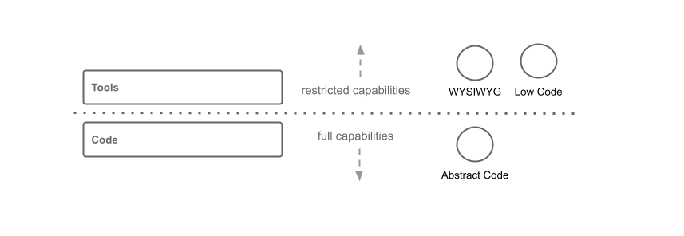

# Abstract Code Guide

	

	    
<b>Abstract Code</b> is a programming approach, where abstract language is used to build software as an alternative to low code and no code.
	    <a href="#?id=about">Learn more</a>
	

	

	<!--div style="background: #b583cca4;">
	    
<b>Content</b>  
		<ul>
			<li><a>About</a></li>
			<li><a>Coding Basics</a></li>
			<li><a>Abstraction</a></li>
			<li><a>Abstract Language</a></li>
		</ul>
	

	</div-->
	<!--div style="border: 1px solid #dc90cbb8; background: none;">
	    <a href="#?id=coding-basics"><b>Coding Basics</b>  understand basics of coding
		</a>
	

	

	    <a href="#?id=abstraction"><b>Read about abstraction</b>  ... in computers
		</a>
	

	

	    <a href="#?id=abstract-language"><b>Language Approachs</b>  check out an abstract programing language
		</a>
	</div-->

## About

Welcome to "Abstract Code" Programming. This publication is to show and discuss approaches for building software using ***real programming*** code in an abstract and versatile way. Approaches, that go beyond hard-core programming but also beyond "Low Code". You will:

* ***Learn*** about abstract ways to develop software
* ***See*** different approaches for different problems
* ***Develop*** software using abstract programming languages

Abstract Code Programing doesn't have an official definition. It is discussed here as a development approach that aims to provide a way to develop software using programming languages that are designed with abstract principles and are accessible even for non programmers. Projects, like the abstract programming language PUZZLE are developed and discussed.

## Why abstract code?

Usually, learning and understanding a programming language isn't so easy (except for pros). So in the last decades, different approaches have been born in order to make "creating software" available for non-professionals and easier for professionals. Common examples are Low Code Platforms, drag-n-drop programming tools or WYSIWYG software. These approaches all work with abstraction.

Abstraction has been around since computers were created. Abstraction works on the concept of removing complexity in order to make something simpler. The approaches mentioned above are offering a way to create something in a simpler fashion compared to writing compex programming code. The price, one has to pay here is missing capabilities. That is why oftentimes these tools focus on specific tasks or domains. Like tools for creating Graphical User Interfaces or tools for building business workflows.

***Abstract Code***, on the other side uses programming code instead of graphical tools. Opposed to typical general-purpose programming languages, the abtract code language is designed to be understandable, using abstract syntax. You will learn more about the language structure [here](LANGUAGE-GUIDE).

