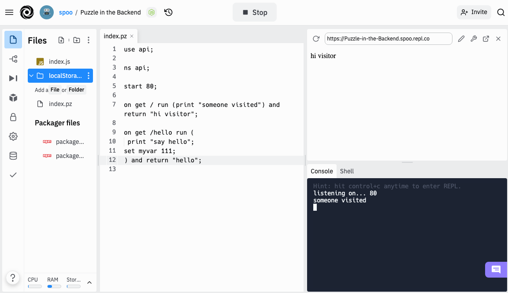

  

<h3 class="header">PUZZLE is an abstract programming language, that is simple,  extendable and runs in any JavaScript-based environment</h3>

  <!--iframe src="https://abstractcode.dev" style="border:none;height:500px;width:100%"></iframe-->

 

    

  <pre style="margin:-10px;padding:10px;border-radius: 10px;background: #000000 !important;">

<code style="font-size:14px !important;color:#EEEEEE;background: #000000 !important;">render (
  &#60;div>hello, world&#60;/div>

  &#60;a href="...">OK&#60;/>
)

</code></pre>
  <h3><a href="#/chapters/MODULES?id=ui">Graphical Programming</a></h3>
  For Browsers
 

 

    <pre style="margin:-10px;padding:10px;border-radius: 10px;background: #000000 !important;"><code style="font-size:14px !important;color:#EEEEEE;background: #000000 !important;">use api;

on get /test run (
    print "/test was called"
) and return "done!"
</code></pre>
  <h3><a href="#/chapters/MODULES?id=api">Develop Backends</a></h3>
  Runs on top of Node
 

   

    <pre style="margin:-10px;padding:10px;border-radius: 10px;background: #000000 !important;"><code style="font-size:14px !important;color:#EEEEEE;background: #000000 !important;">let js_word = "hello";

puzzle.parse('
  print js_word;
')
</code></pre>
  <h3><a href="#/chapters/GUIDES?id=embedded-in-js">Integrate into JavaScript</a></h3>
  Mix PUZZLE code with JS code
 

 <!--div class="box" style="text-align:left;">
    
  <h3><a href="#/chapters/GUIDES?id=hosted-clouds">Quickstart a Project</a></h3>
  Develop and run in the Cloud  Worry-free on Replit
 </div-->

<!--div class="cover_codebox" style="display: block;">
<pre><code class="lang-puzzle" style="font-size:22px !important;color:#EEEEEE">use ui

render (
  &#60;div>Click the enter key&#60;/div>
)

on key enter (alert "enter was pressed")
</code></pre>
<!--center>
  <a href="#/chapters/GUIDES?id=browser" class="btn">Start on Browser</a>
</center->
</div-->

<!--div class="scroll-h">
<b>START: &nbsp; </b> 
<a href="#/chapters/GUIDES?id=browser" class="bubble">Browser</a>
<a href="#/chapters/GUIDES?id=use-with-node" class="bubble">Node</a>
<a href="#/chapters/GUIDES?id=embedded-in-js" class="bubble">Embedded</a>
<a href="#/chapters/GUIDES?id=hosted-clouds" class="bubble">Hosted</a>
<a href="#/chapters/GUIDES" class="bubble">more</a>
</div-->

<!--br>

<a href="#/README" class="cover_box_article">
	<h3>Learn PUZZLE</h3>
	Now!
</a>
<a href="#/chapters/MODULES" class="cover_box_article click">
	<h3>Check out Modules</h3>
	Modules for many purposes
</a>

<br-->

  
Try on <a href="https://codesandbox.io/s/puzzle-ui-g942w2?file=/index.html:0-330" target="_blank" class="btn">Codesandbox</a> or start on other &nbsp;<a href="#/chapters/GUIDES"><u>Platforms</u></a>

  <a href="#/README">

 

</b>
</a>

