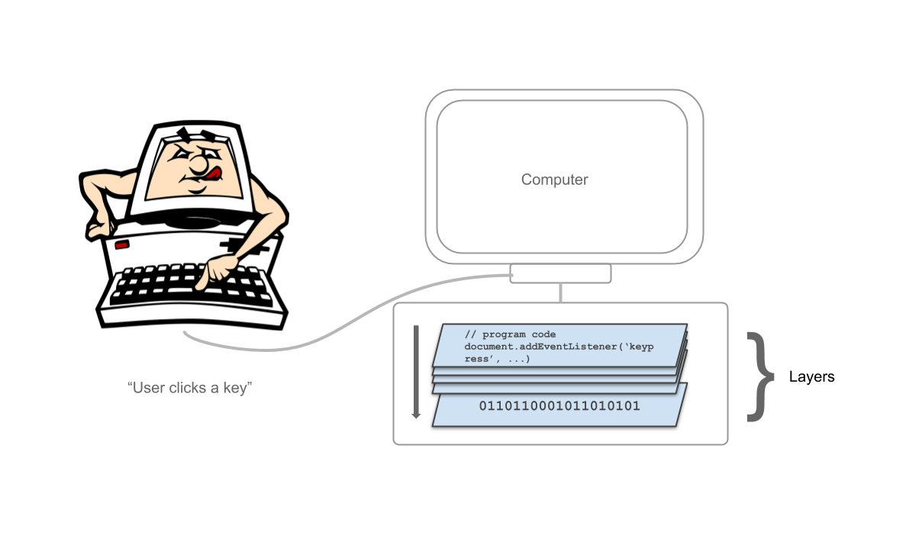

# Abstraction

> The goal of "abstracting" [...] is to reduce complexity by removing unnecessary information [<cite>[1]</cite>]

The concept of abstraction itself has been used in computers ever since they were created. Computers work on complex concepts that are split into different layers.

> Abstraction is done with Layers. Each Layer makes the usage of it's underlying layer simpler.

Everbody knows, computers only understand 0 and 1. Programming, however is not done by using zeros and ones. It is done by using readable code. So there must be something in between, something that somehow translates code into 1 and 0. This is where layers join the game. 

Layers are here to abstract the layer beneath it. Computers work on many, many layers. So from a user input, like the press of a key on the keyboard, many different layers are involved, before that command reaches the 1 and 0 level.

<small>([Image source](https://lh6.googleusercontent.com/proxy/erajlo1MU6tYmH76em7xwahjWRRec_jwCYDUM_E0bdOLQNMWEHfQM6AwzbVBqDMUG8vX3rxYu2EgS_ekD2CvvxGD3qor-i6eZyCSBVe_G-8BjKyhjN1B7wxwBx982YuyqAoB=w1823-h1193))</small>

Every programming code runs on a pretty high layer of that stack, meaning that code is a layer of abstraction that is fairly simple, compared to the 0 and 1 layer. 

Therefore a programmer usually doesn't have to deal with zeroes and ones.

[1]: https://techterms.com/definition/abstraction#:~:text=In%20computer%20science%2C%20abstraction%20has,of%20computers%20in%20abstract%20terms.

# Abstract Code

> First of all, there is no official definition of "Abstract Code". I'll be using this term to describe the principle of this publication.

When you google "Abstract Code", you'll mainly find results that have to do with the concept of [Abstraction](...).
And the Idea of Abstraction is actually a good point to start. You can read more about abstraction [here]().

What the concept of this publication is about, is finding a way to develop software without the (full) complexity of general purpose programming languages while still having the (full) flexibility of general purpose programming languages.

Naturally, the above statement sounds conflicting -  and hard to achieve. And it is.
This is why concepts, like Low Code Programming have evolved in the last couple of years.

Let's talk about the three main conpepts of abstract code programing. These concepts actually represent the name of this whole thing:

* Abstract (as in abstraction)
* Code (computer code)
* Programming (the process of coding)

# Other Abstract Approaches

***"Programing isn't always just done with code."***

Of course, code is the most common way to program software. But there are other ways to develop software beyond code.

> Code is a set of instructions that tell a computer what to do, remember? These "instructions", however can also be described in other ways as well - beyond code.

Code is also the lowest level to describe there instructions. But over time, people have found ways to make software development possible not just by writing code, but by providing more abstract ways to program - beyond code. Common examples range from "No Code" to "Low Code".

* ***No Code*** doesn't require writing any code. Typically programming is done by using WYSIWYG Tools
* ***Low Code*** does require writing code, but not necesseraly. This is typically a mix of code and WYSIWYG tools.

## WYSIWYG programming tools

WYSISWG stands for "What You See Is What You Get". Tools that work on this principle allow the user (here: programmer) to create something in the same way it will appear in the result. [<cite>[2]</cite>]

What that means is that programming is done using graphical tools that let's the user create something by using drag'n drop, clicking an writing.

[2]: https://www.dictionary.com/browse/wysiwyg

## No Code

## Low Code

