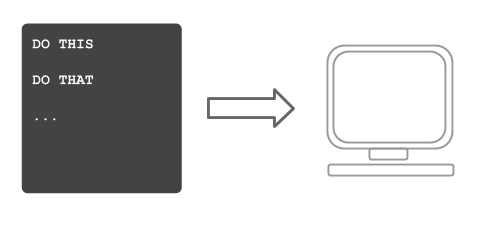
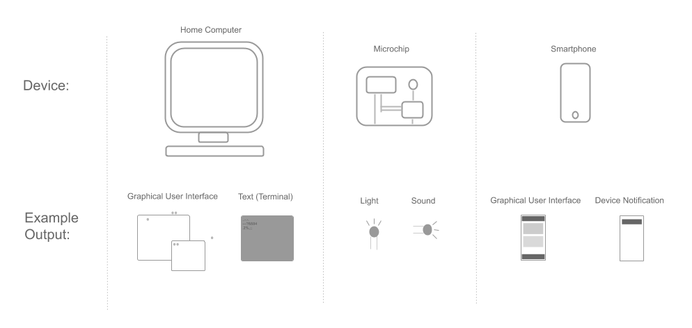

# The Basics

> The basics are a good point to start not only for non-programmers but also for professionals. This chapter features the main parts involved in programming:
***From "What is code?" over "What is a Computer?" to "How to run code?"***

---

## What is Code?

```javascript
var words = ["Hello", "World"];
var sentence = words.join(" ");
function printSentence(){
	console.log("The full sentence:", sentence);
}
printSentence();

```

Code, source code, computer code, program code. There are many names that can be used to describe it. But what exactly is code?



In the computer world, a "code" is a set of instructions that tells a computer what to do. A code, for instance, can consist of the instruction to output a text on the screen of the computer. 
Sounds simple, but still there are open questions...

* How is an instruction (aka "code") passed to the computer
* What format should this "instruction" have?
* Where exactly shall the text be output?
* ***Where to start???***


## The computer

The first thing one needs in order to run code is a computer. Simple, right? No.

Computers, today exist in many, many shapes, variations, forms, and kinds. Computers can be as small as a nut 🥜 or as large as a house 🏠. Example Computers are:

* Pocket Calculators
* Smart Phones
* Laptops
* Microchips
* "Computers" as in Home-Computer

Since computers can be so different compared to each other, the way they work and the way they handle "code" is also very different. Computers run an operating system (Windows, macOS, Linux, ...). An operating system is the heart of every computer. It is basically the part that makes everything work. It's the ***bridge*** between the computer itself and whatever would like to input any instructions - like "code". 

Operating systems, depending on the kind of computer they run on, can either be quite extensive or very basic. Home-Computers run extensive operating systems, since they have to offer a lot of features. Microchips, on the other hand, run more basic operating systems, since they oftentimes have a specific job to perform and don't need many features.

However, every operating system works on the ***IPO*** Principle:

***Input, Processing, Output***

Code is actually the most simple example of an IPO.

The code is the ***input***. The computer then ***processes*** the code and performs the instructions in it. As a result, an ***output*** is generated by the computer.

## Write code

Let's write some code... But wait, how?

As we have learned, a code is a set of instructions, that tell a computer, what to do. But what do these instructions look like?

If we would like to output a text on the computer, what doest the code look like, that achieves this?

This is where programming languages come in.

In real life, people use a "language" to communicate to each other. 

Person A tells Person B to "hand over the cup of tea". This is the instruction. Person B hands over the cup of tea. That's the processing. In the end, Person A has the cup of tea. This is the output of this whole instruction. Language was used to execute the communication. 

Code is Language. And just like in real life, there are many different languages. They use different words, syntax and semantics.

Common Programming Lnguages are: Python, Java, JavaScript or C.

> Code itself is just a text. A sequence of words and tokens, that together form the instructions for the computer.


Example 1: A code that outputs a text on the terminal, written in Python.

```python
print("Hello")
```

Example 2: The same code, written in Java.

```java
System.out.print("Hello");
```

Example 3: The same code, written in Puzzle.

```puzzle
print Hello
```
As you can see, these examples all do the same, but look very different.

## Input/Output

> Stupid question: where is code inserted into the computer?

Code is nothing but a text. This text somehow needs to be inserted somewhere for the computer to process - but where? 

Code can be input directly via the ***command line interface*** or saved as file(s) that will be passed to the [language/runtime](...).

> A ***Command line interface***, or ***CLI*** is a text based program that is part of the operating system. A CLI takes code (typically single commands) as input and writes text as output.


### Output channels

***The possible output of a code is bound to the output capabilities of the computer***. If a computer has a display attached, graphic output is available. If we're talking about a microchip, that doesn't have a screen, the output would be the blink of a light or something.




The result of what a code does typically has some output. An output can be whatever the computer has to offer:

* Output on the screen - if a screen is available
	* graphic output (user interface)
	* text output (terminal)
* Output via devices
	* printer
	* sound
	* ...
* Output via network
	* communication with other computers

Whatever output mechanisms are available, the input is the same across all types of computers: ***code***


## Run code

Once a code is written, the next step is to pass it to the computer to run it. This step again is different from language to language. 

In order to run a code, the computer needs to "know" the language. So the "language" itself must be installed on the computer. Once installed, the operating system will introduce the language as a "program", that is used to execute the code.

TBC...
