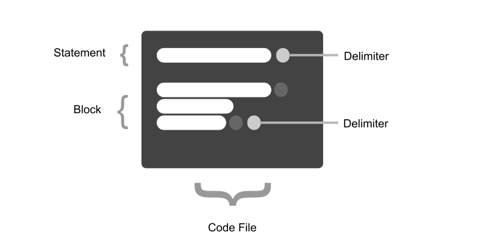

# Language Guide

> This chapter shows and discusses "abstract code" with the PUZZLE programing language


# What is PUZZLE?

The PUZZLE project is a programming language, that ***abstracts functionality using simple words and phrases***

> It's an abstract programming language

The whole language is based on an extendable, dynamic language configuration, making it easy to build custom syntax and semantics. In this configuration, single identifiers (words) can be defined, dynamically combined and connected. Each word or phrase (a combination of words, either in a specific order or not) can be mapped to the execution of a more complex functionality, implemented in the background.


PUZZLE's key features are:

* Simple syntax
* Dynamic semantics
* Textual abstraction for more complex functionalities
* Easily customizable
* Extendable
* Runs on many platforms
* Can be used to build many things

## Simple syntax

The syntax of PUZZLE is heavily based on natural language. 
A quick example:
```puzzle
print Hello
```

## Dynamic semantics

Even different semantics in the shape of different word orders for the same meaning are possible.

## Textual abstraction

Pretty much any complex functionality can be abstracted in text: a word or phrase.

## Easily customizable

At the base of the language lies a dynamic configuration which allows one to define custom syntax and semanticy in order to execute some functionality.

## Extendable

Custom syntax can be published as modules. Any other PUZZLE user can use these modules. 

Modules can be used over the web or from a local file.

```puzzle
use https://domain.com/email.js;

use email.js;
```

## Platform independent

The PUZZLE language itself is written in JavaScript, meaning that any PUZZLE code runs, where JavaScript runs.

> JavaScript (and PUZZLE) runs on pretty much any device. From Microprocessors, Smartphones, Desktops to Servers and Clouds.

## Versatile

Since PUZZLE is a programming language, the capabilities are versatile. It is not restricted to anything specific. You can create Graphical Interfaces, Server Code, Websites, Desktop Apps, Workflows or embedded Applications.

# Language concepts

Programming means passing a set of instructions to a computer. These instructions are written with programming code. Every programming code follows a certain structure that makes it easier for a computer to understand and easier for a developer to write and read. Pretty much every programming language is structured like this:



## Code files

Code is typically saved into files. Each file contains the programming code. If the software requires a lot of code, it is split up into multiple files for readability, maintainability and structure. Code files can be referenced amongst each other.

## Statements

Inside a file, code is split up into different statements. A statement is a single (or multiple) instruction that a computer processes individually. Statements are seperated fromeach other using a delimeter. Many languages use a semicolon for this and so does PUZZLE.

An example with PUZZLE:
```puzzle

print "hello World" ;

<--------------->  <->
    Statement    Delimeter

```