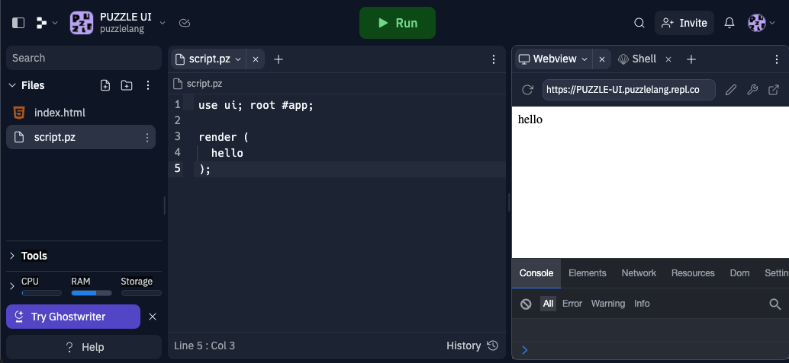
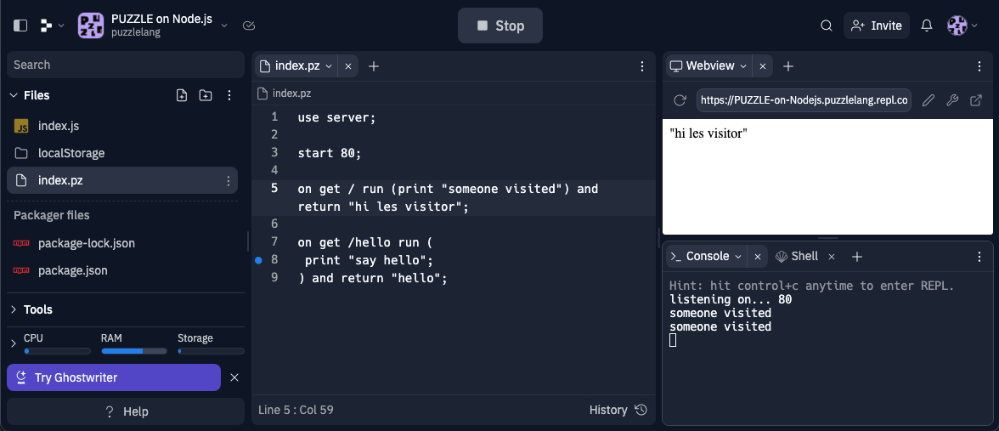

# Develop online apps on Replit

Replit.com is a cool online platform for building and running online apps.

# Frontend

## 1. Get the PUZZLE template

Go to [replit.com/@puzzlelang/PUZZLE-UI](https://replit.com/@puzzlelang/PUZZLE-UI) and get the template.

## 2. Develop

## 3. Run

Run using the "Run" button.

# Backend

## 1. Get the PUZZLE template

Go to [replit.com/@puzzlelang/PUZZLE-on-Nodejs](https://replit.com/@puzzlelang/PUZZLE-on-Nodejs) and get the template.

## 2. Develop

## 3. Run

Run using the "Run" button.
